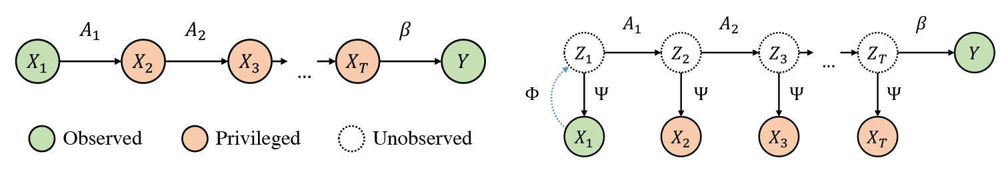

# Learning nonlinear models from privileged time series

This repository contains the code to reproduce the experiments shown in the paper "Efficient learning of nonlinear
prediction models with time-series privileged information" presented at NeurIPS 2022. The paper is available on arxiv
at [https://arxiv.org/abs/2209.07067](https://arxiv.org/abs/2209.07067).



## Learning Algorithms

In the **models** package one finds all relevant algorithms used in the paper. This includes variants of generalized
LuPTS as well as the representation learning methods displayed below. For the implementations we mostly made use of
Scikit-Learn, Numpy and PyTorch.


## Data Sets

Unfortunately, we cannot make the ADNI Alzheimer data set available as part of the repository. The other data sets used,
are included and can be used straight away. In addition to the data sets described in the paper there is a synthetic
linear Gaussian system as well. This system is fully observed and utilized by the other synthetic data generating
processes, but it may be used as a standalone, too. The code producing the **Clocks-LGS** image data set is available,
as well.

## Experiments

The repository is structured in packages and contains a folder named **Scripts**. In there one finds everything that is
needed to quickly replicate results.

There are two groups of models and five data sets: The first group of models comprises variants of generalized LuPTS and
the corresponding classical learning alternatives. The second group contains representation learning algorithms. For
every combination of data set and model group the **Scripts** folder contains a file with a corresponding experiment,
apart from the image prediction task, where we only include one script with representation learners. Each of these
experiments computes the coefficient of determination and the mean squared error over a range of settings that can
easily be defined in the scripts. For synthetic data sets the mean SVCCA coefficients and the squared bias and variance
are computed as well. All result data is stored in csv-files in a folder that is specified at the top of each script,
subfolders are created by date and time for each experiment run. Additional python scripts include the code to produce
the double descent curve for the LuPTS estimator (Figure 2)
and the latent recovery experiment seen in Figure 7b (the latter requires trained models from one of the experiment runs
mentioned above).

### Visualizations

Note that some visualizations shown in the paper, in particular the SVCCA scatter plot and the bias-variance curves,
were created using external software based on the csv files produced by the experiments. The visualizations concerning
the prediction accuracy are created automatically using matplotlib. At the end of each script a call is made to the
visualization function of the experiment class. It takes keyworded arguments to modify the resulting plots in terms of
the axes limits for example.

### Resources & SLURM Cluster

We recommend reducing the number of repetitions when running experiments on a single machine. All scripts are configured
for single machine computation as this runs without further configuration. One specifies the number of CPUs to use at
the top of each script using the __worker__ variable. How to use the code on a SLURM cluster is described below but some
code might need small adaptions depending on the cluster setup.

For training on a GPU cluster one needs to adapt the file __experiment/gpu_slurm.sh__. The scripts need to be changed to
call the __run_slurm_job__ method of the experiment class instead of __run_single_node__. To then collect the results
from different nodes one uses the experiment methods __merge_slurm_jobs__, __compute_aggregate_scores__
and __save__ in this order. One might need to inspect the experiment package to adapt the shell script correctly. The
PyTorch models automatically check for CUDA and use a GPU if available.

### Random Seeds

Synthetic data sets take a random seed as an argument on creation, this determines their dynamics. During an experiment,
when requesting a train and test set, the experiment class passes another random seed that only determines the data
sampling.

## Requirements

We recommend installing the packages found in __requirements.txt__ via pip in a new environment using python 3.8.

```
pip install -r requirements.txt
```
